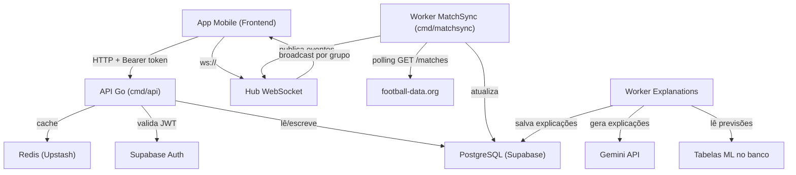
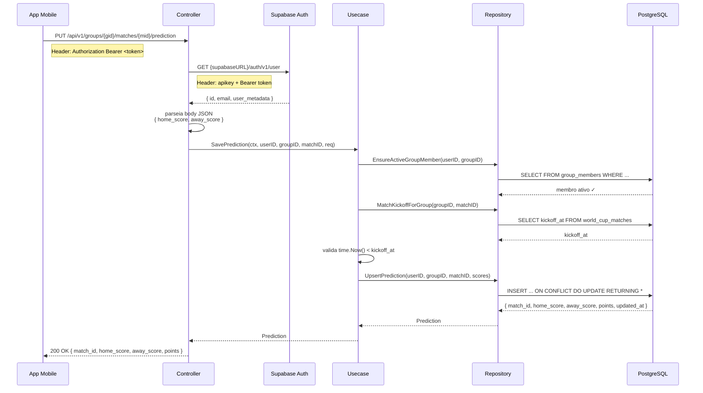
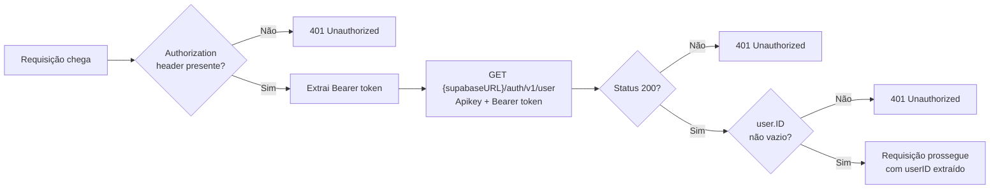
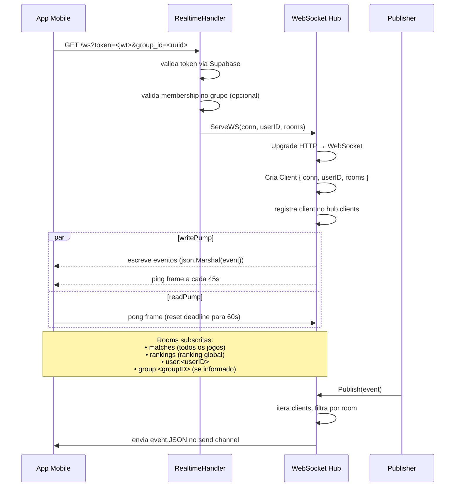
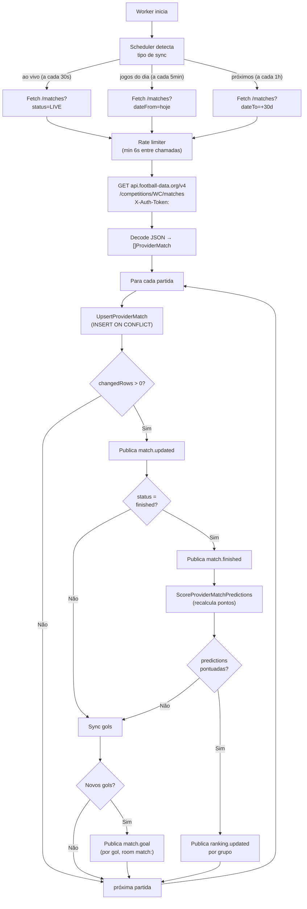
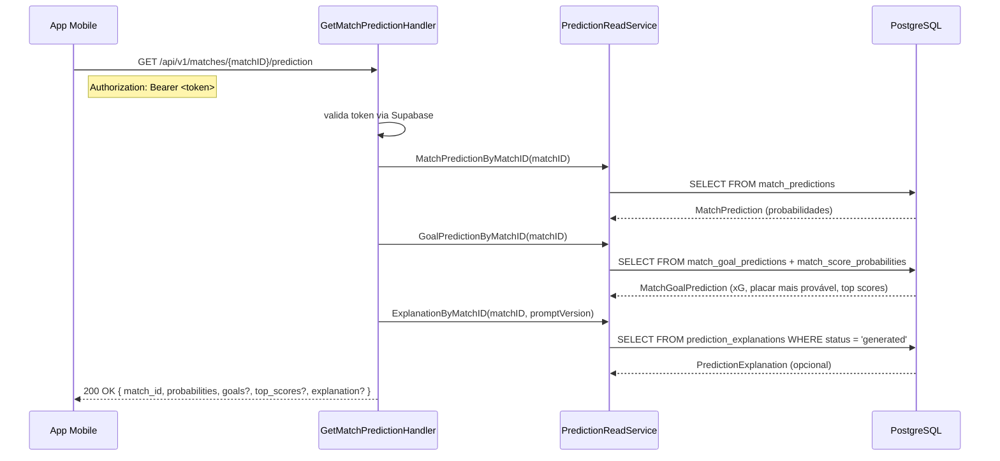
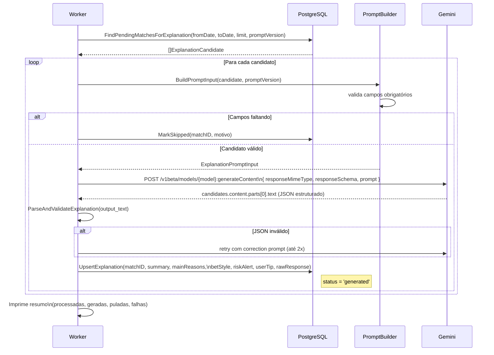

# Backend — Fluxo do Sistema

Documentação dos fluxos principais do backend Go do Palpite!: ciclo de vida de requisições HTTP, WebSocket, sincronização de partidas e geração de explicações da PalpitAI.

---

## Visão geral da arquitetura



---

## 1. Ciclo de vida de uma requisição HTTP

Toda requisição protegida passa por autenticação, depois desce pela stack controller → usecase → repository.



**Camadas e responsabilidades:**

| Camada | Responsabilidade |
| --- | --- |
| `controller` | Parse de request, validação de entrada, escrita de response |
| `usecase` | Orquestra regras de negócio, chama múltiplos repositories |
| `repository` | SQL isolado por contexto, sem lógica de negócio |
| `domain` | Regras puras (cálculo de pontos, normalização de status) |

---

## 2. Autenticação via Supabase

A validação de JWT ocorre em toda requisição protegida, sem estado local no backend.



---

## 3. WebSocket — conexão e ciclo de vida

O WebSocket permite que o backend empurre eventos em tempo real para o frontend sem polling.



### Estrutura de um evento

```json
{
  "name": "match.updated",
  "payload": {
    "match_id": "uuid",
    "home_score": 2,
    "away_score": 1,
    "status": "live"
  },
  "room": "matches"
}
```

| Evento | Room | Trigger |
| --- | --- | --- |
| `match.updated` | `matches` | Qualquer mudança de placar/status |
| `match.finished` | `matches` | Status virou `finished` |
| `match.goal` | `match:<matchID>` | Novo gol detectado |
| `ranking.updated` | `rankings` + `group:<groupID>` | Partida finalizada e pontos calculados |

---

## 4. Sincronização de partidas (MatchSync)

O worker `cmd/matchsync` faz polling na football-data.org e propaga mudanças via WebSocket.



---

## 5. Leitura de previsão de partida

O endpoint `GET /api/v1/matches/{matchID}/prediction` agrega probabilidades, expected goals, top placares e explicação da PalpitAI em uma única resposta.



**Comportamento por campo:**

| Campo | Obrigatório | Comportamento se ausente |
| --- | --- | --- |
| `probabilities` | Sim | 404 se `match_prediction` não existir |
| `goals` | Não | Campo omitido na resposta |
| `top_scores` | Não | Campo omitido na resposta |
| `explanation` | Não | Campo omitido se não gerado ainda |

---

## 6. Geração de explicações da PalpitAI

O worker `cmd/workers/generate_prediction_explanations` lê previsões do ML e gera explicações em português via Gemini API.



### Estrutura do prompt e output

**Input para o modelo (por partida):**
```
Match: Brasil vs Argentina, 2026-06-15
Result: HOME_WIN 62% | DRAW 21% | AWAY_WIN 17% (confidence: high)
Goals: xG casa 1.8 | xG fora 1.1 | placar mais provável 1x0
Top scores: 1x0 (18%), 2x0 (12%), 2x1 (10%)
Metrics: elo_diff=+85, form_home=72, form_away=64, wc_history_home=88
```

**Output estruturado (JSON schema validado):**
```json
{
  "summary": "Brasil entra como favorito com histórico superior...",
  "main_reasons": [
    "Vantagem de ELO significativa (+85)",
    "Melhor forma recente (72 vs 64)",
    "Histórico de Copa dominante"
  ],
  "bet_style": "moderate",
  "risk_alert": "Argentina tem atacantes de alto nível capazes de virar",
  "user_tip": "Aposte no Brasil vencendo, mas considere margem estreita"
}
```
