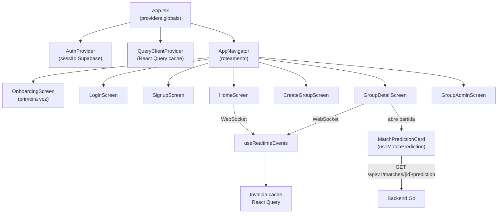
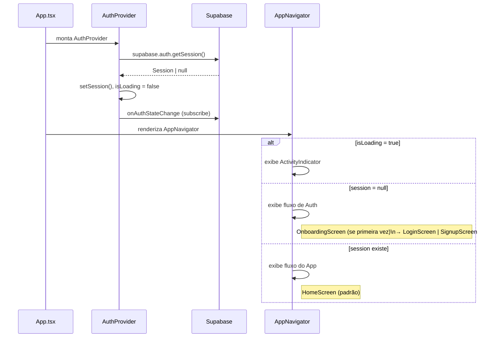
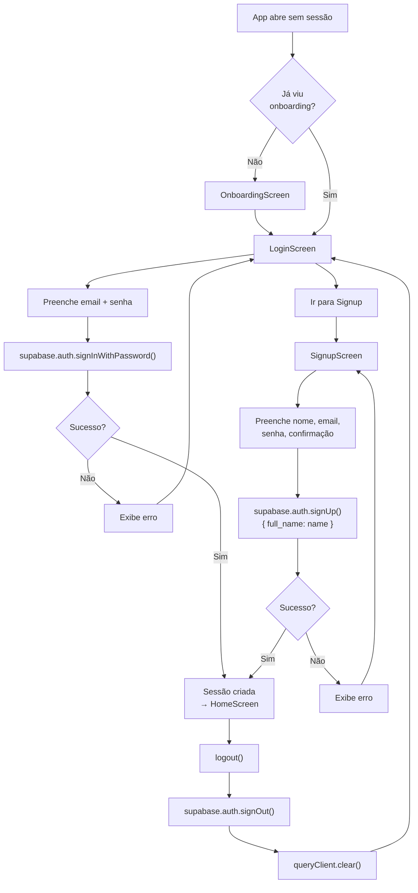
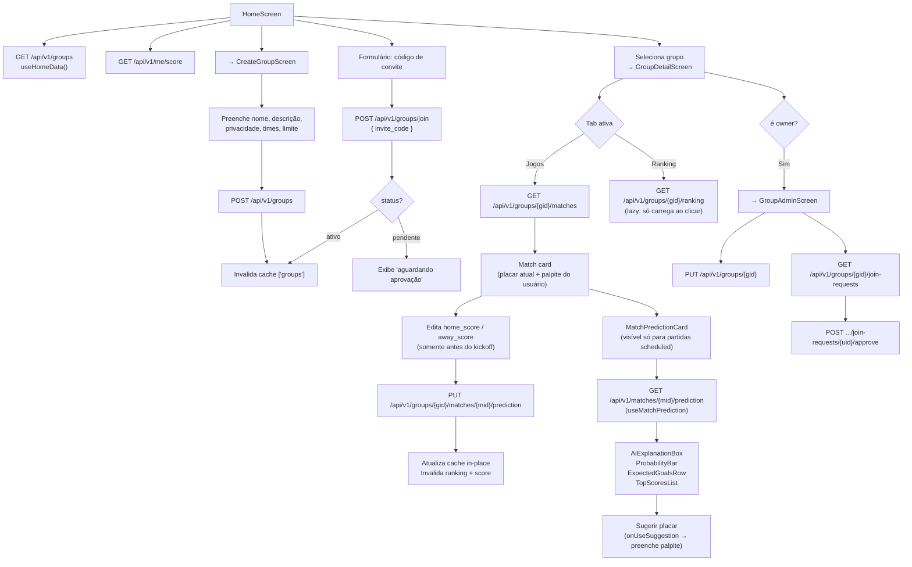
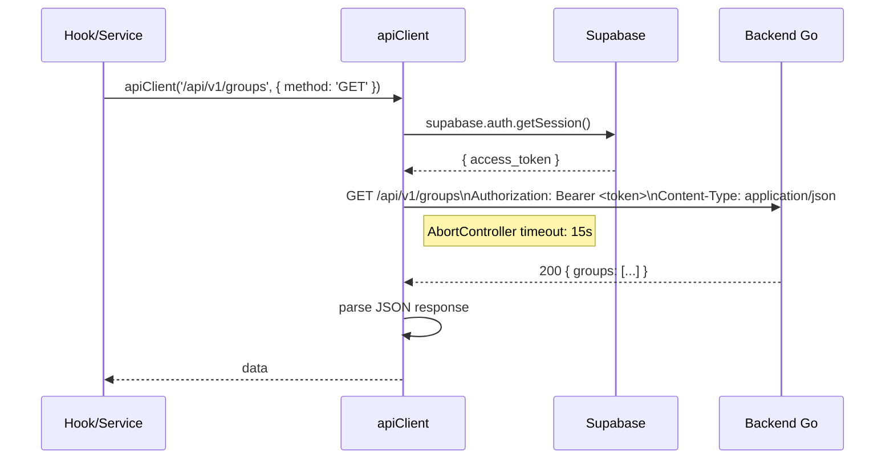
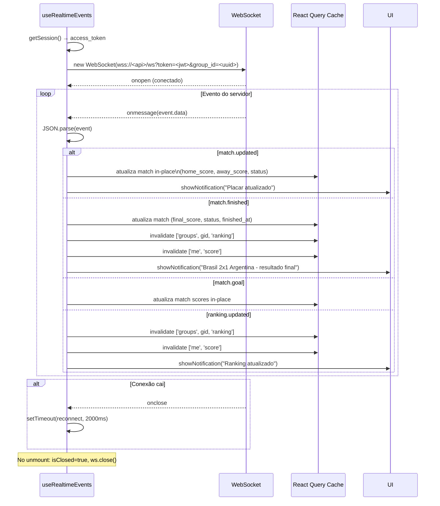
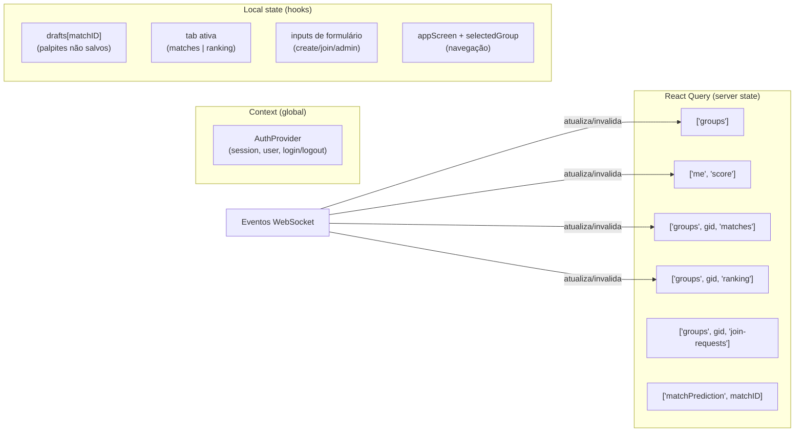
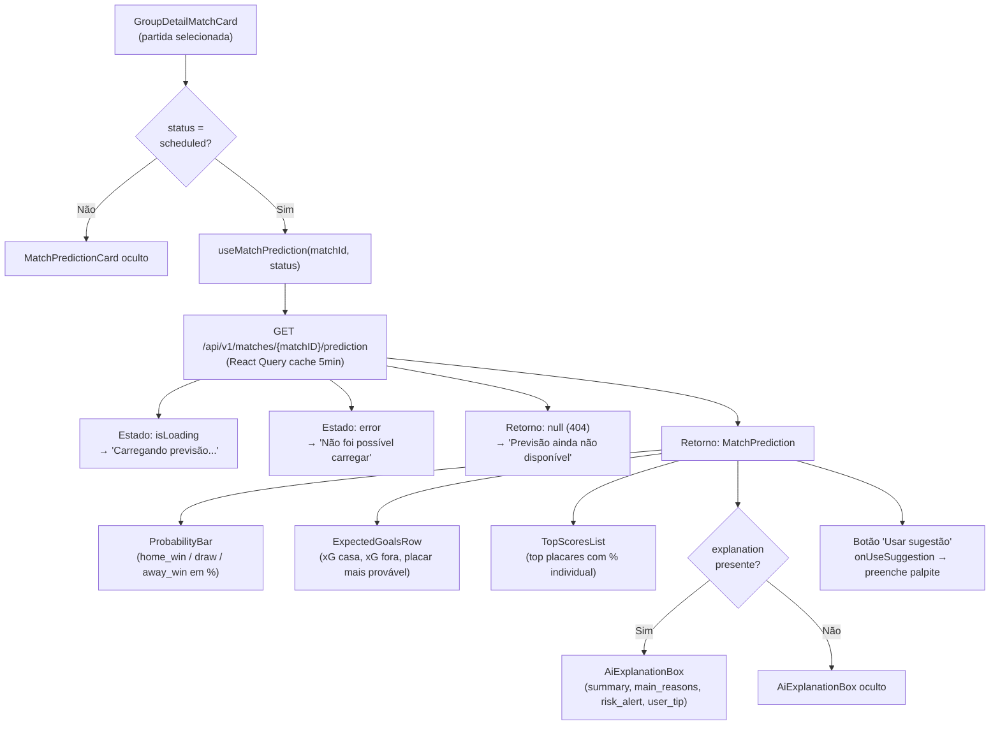

# Frontend — Fluxo do Sistema

Documentação dos fluxos principais do app mobile React Native do PalpitAI: inicialização, autenticação, grupos, palpites e realtime.

---

## Visão geral

---

## 1. Inicialização do app

---

## 2. Fluxo de autenticação

**Token de sessão:** o `access_token` do Supabase é extraído a cada chamada HTTP pelo `apiClient` e enviado no header `Authorization: Bearer <token>`.

---

## 3. Fluxo de grupos e palpites

---

## 4. Fluxo de requisições HTTP

Todas as chamadas ao backend passam pelo `apiClient`, que injeta o token automaticamente.

---

## 5. Fluxo realtime (WebSocket)

### Mapa de eventos × cache

| Evento | Payload relevante | Cache invalidado / atualizado |
| --- | --- | --- |
| `match.updated` | match_id, home_score, away_score, status | Atualiza in-place `['groups', gid, 'matches']` |
| `match.finished` | match_id, final scores, finished_at | Atualiza in-place + invalida ranking e score |
| `match.goal` | match_id, scores parciais | Atualiza in-place |
| `ranking.updated` | group_name | Invalida ranking e score |

---

## 6. Gerenciamento de estado

**Configuração do React Query:**
- `staleTime: 15.000ms` — dados frescos por 15s, sem refetch desnecessário
- `refetchOnReconnect: true` — revalida ao reconectar
- Mutations com `retry: 0` — sem auto-retry em erros
- `['matchPrediction', matchID]` com `staleTime: 5min` — previsões mudam pouco; `retry: 1`

---

## 7. Feature de previsões de IA

O módulo `features/predictions` exibe a previsão gerada pelo ML+IA diretamente no card de partida, antes do kickoff.

**Componentes do módulo:**

| Componente | Responsabilidade |
| --- | --- |
| `MatchPredictionCard` | Container principal; orquestra loading/error/empty states |
| `ProbabilityBar` | Barra visual de probabilidades home/draw/away |
| `ExpectedGoalsRow` | xG de cada time e placar mais provável |
| `TopScoresList` | Lista os top placares por probabilidade |
| `AiExplanationBox` | Exibe a explicação gerada pelo Gemini (condicional) |

**Regra de visibilidade:** `useMatchPrediction` só busca dados quando `isScheduledStatus(status) = true`. Para partidas live, finished ou timed, o card não é exibido.
