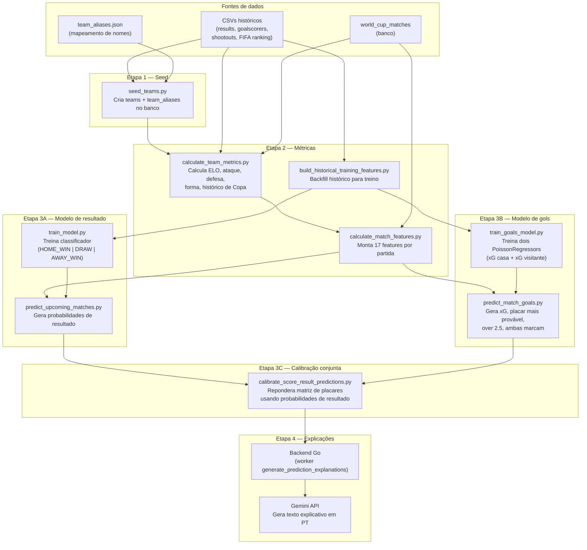
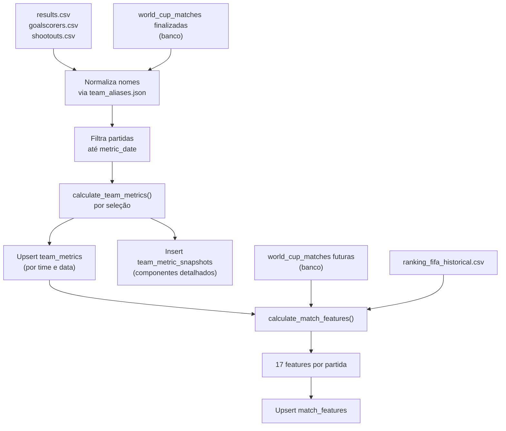
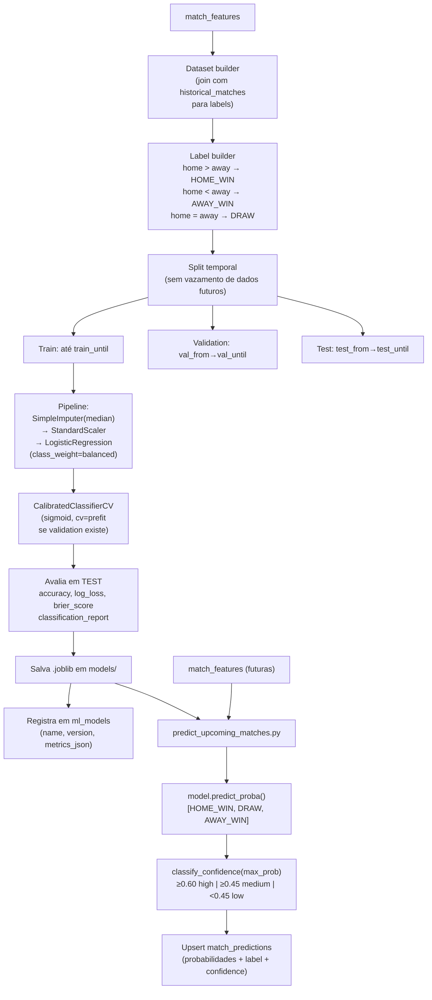
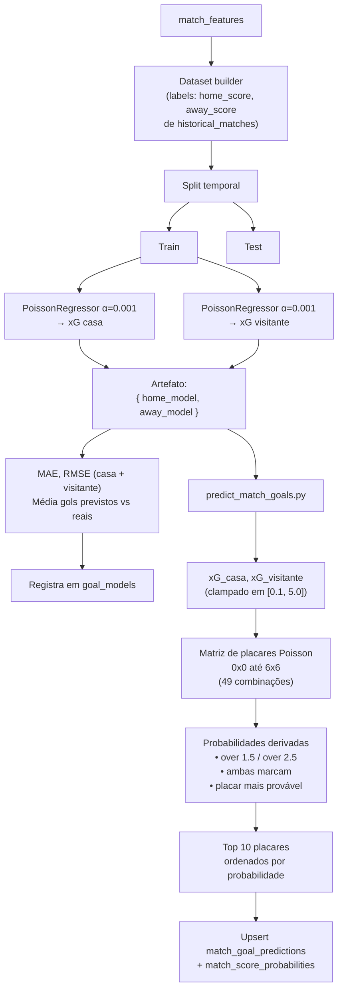
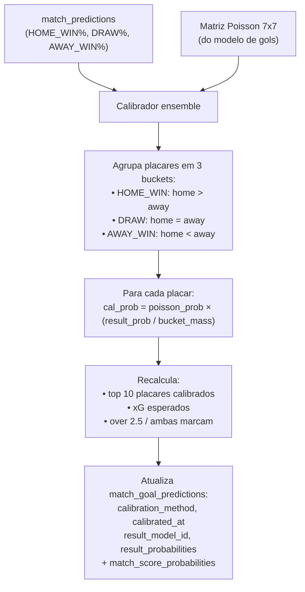
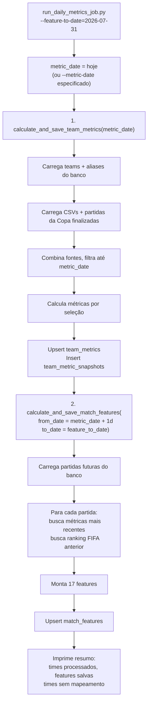

# ML Service — Visão Geral do Pipeline

O pipeline de ML da PalpitAI é dividido em etapas sequenciais. Cada etapa produz dados que alimentam a próxima, culminando em previsões de resultado e placar que o backend Go consome do banco de dados.

---

## Visão geral das etapas

---

## Tabelas produzidas por etapa

| Etapa | Tabelas preenchidas |
| --- | --- |
| Seed | `teams`, `team_aliases` |
| Métricas | `team_metrics`, `team_metric_snapshots` |
| Features | `match_features`, `historical_matches` |
| Modelo resultado | `ml_models`, `prediction_runs`, `match_predictions` |
| Modelo gols | `goal_models`, `match_goal_predictions`, `match_score_probabilities` |
| Calibração | Atualiza `match_goal_predictions` e `match_score_probabilities` |
| Explicações | `prediction_explanations` |

---

## 1. Etapa 2 — Cálculo de métricas e features

---

## 2. Etapa 3A — Treino e predição de resultado

---

## 3. Etapa 3B — Treino e predição de gols

---

## 4. Etapa 3C — Calibração conjunta

Combina as probabilidades do modelo de resultado com a matriz de placares do modelo de gols.

**Efeito da calibração:** um modelo de gols pode prever 1x1 como placar mais provável, mas se o modelo de resultado diz 62% HOME_WIN, a calibração redistribui probabilidade para placares com vitória do time da casa.

---

## 5. Job diário

O job diário recalcula métricas e features com a data de hoje, mantendo o banco atualizado à medida que novas partidas são disputadas.

